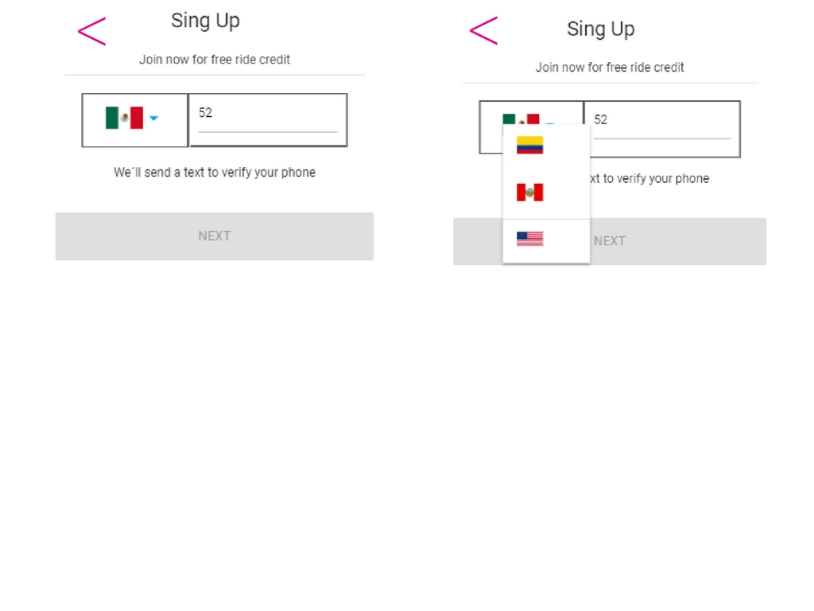
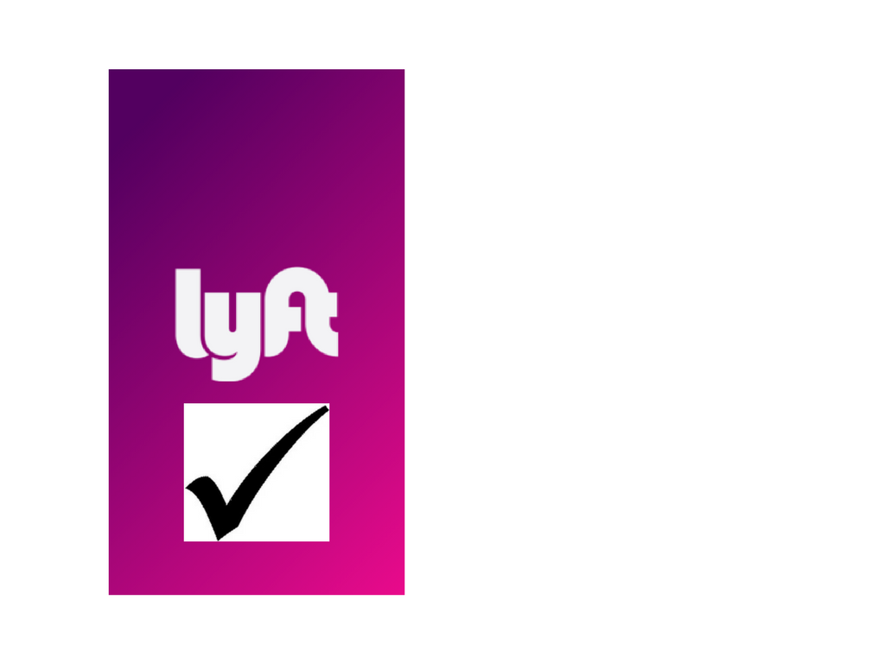

## **Lyft**

### Descripción

Replica del sitio de **Lyft**, cumpliendo los pasos necesarios para que el usuario pueda registrarse.

**FLUJO DE LA APLICACIÓN**

Vista splash con duración de 2 a 5 segundos que redirecciona a la vista de inicio. La vista de inicio cuenta con dos botones, a continuación se presenta el flujo de **SING UP**.

En la siguiente vista tenemos el formulario donde el usuario puede escoger el país y debe ingresar su número de teléfono. El botón de **NEXT** debe estar deshabilitado hasta que se ingrese un número de 10 dígitos.

Una vez ingresado, el número de teléfono se habilita el botón y al dar *click* debe enviar una alerta con un código generado aleatoriamente (LAB-000) y redireccionar a la siguiente vista.

En esta vista se debe ingresar el código dado anteriormente y una vez hecho esto se habilita el botón que redirecciona al usuario a la vista donde ingresa sus datos. (Puede tener la opción de enviar otro código.)

Para ingresar los datos, se requiere de un formulario que solicite su nombre, apellido y correo electrónico. Deberá también tener un checkbox para que se acepten los términos y condiciones del servicio.

Realizado lo anterior, sólo se deberá mostrar una vista al usuario que le indique que ha concluido con el registro exitosamente.

